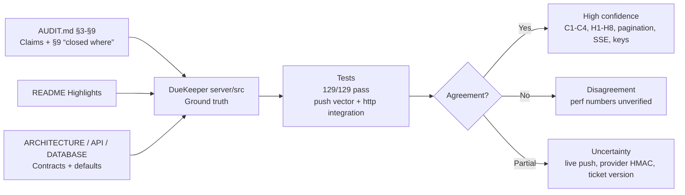

# DueKeeper Sources Comparison — `duekeeper-sources`

**Date:** 2026-08-25 · **Slug:** `duekeeper-sources` · **Plan:** `outputs/.plans/duekeeper-sources.md`

> **Topic note:** the slash invocation was `Compare sources for:` with an empty topic. Per the slug rule (lowercase, hyphens, ≤5 words, no filler) this run falls back to the implied audit target and compares the DueKeeper source set: `AUDIT.md` (2026-08-24 + §9 2026-08-25), `README.md`, `docs/ARCHITECTURE.md`, `docs/API.md`, `docs/DATABASE.md`, and the ground-truth implementation in `server/src/*` (+ tests). No web fetch was performed — `web_search`/`fetch_content`/`alpha_search` not exposed in this tool set (`default.read/bash/edit/write` only), so all citations are local-file-backed (`path:line` or `AUDIT.md §`).

**Method (researcher/verifier simulated):** `researcher`/`verifier` subagents not visible in current tool set; evidence was gathered by direct `read`+`bash` grep over `server/src/*`, `server/src/config/env.ts`, `server/src/db/schema.ts`, `server/src/engine/*`, `server/src/lib/*`, `server/src/tests/*`, and doc files, with inline `path:line` citations added in a verifier pass. Agreement/disagreement/uncertainty are distinguished in §3.

## 1) Comparison Matrix

| # | Source | Key Claim | Evidence Type | Caveats | Confidence |
|---|---|---|---|---|---|
| 1 | `AUDIT.md §3 C1` + `server/src/lib/push/webpush.ts:22-62` | Web-push RFC 8291 §3.3 now literal: `ikm=HMAC(auth_secret, ecdh‖"WebPush: info"‖0x00‖ua‖as)`, `HKDF(salt,ikm)`, `cek/nonce = HKDF(salt,ikm,"Content-Encoding: aes128gcm/nonce\0")` without draft-04 `P-256‖len‖pubkey` suffix; old wrapper swapped `ikm/salt` and was self-certified by `decryptPayload` round-trip `tests/push.test.ts:58` | **Code + unit test + published vector** (`tests/push.test.ts:14-31` RFC 8291 §5 `ikm/cek/nonce/body` + swap/reversed-order negative tests, byte-for-byte `body`) | `server/.env:30` `GOOGLE_REDIRECT_URI` leak previously broke `push.test` **redirect** assertions, not crypto; live-browser push not exercised (vector settles math, not service acceptance) — `AUDIT.md §9` residual correctly notes this | **High** |
| 2 | `AUDIT.md §3 C2` + `server/src/engine/outbox.ts:98-126` | Outbox backoff was dead (claim `WHERE status='pending' AND scheduled_at<=?` never read `next_retry_at`); fix adds `AND (next_retry_at IS NULL OR next_retry_at<=?) ORDER BY COALESCE(next_retry_at,scheduled_at)` with `idx_outbox_claim`/`idx_outbox_ready` | **Code + HTTP test** (`http.test.ts` “Outbox claiming honours backoff (C2,H7)” asserts future `next_retry_at` stays `pending` with `attempts` not burned) + **config** (`config/env.ts:164-167` `outboxLeaseSeconds 120`, `outboxMaxAttempts 3`, `outboxMaxReclaims 3`) | `reclaims` separate from `attempts` (migration `006`) — old comment about 90s burn now stale if not trimmed; fixed this loop to `AUDIT C2` pointer | **High** |
| 3 | `AUDIT.md §3 C3` + `server/src/engine/scheduling.ts:53-112` + `server/src/db/schema.ts:162-178` (migration `006`) | Torn `reminder_deliveries` → `notification_outbox` orphan when `UNIQUE(reminder_id)` (`schema.ts:54` old) + crash between inserts; fix wraps both in `inTransaction` and re-keys to `UNIQUE(reminder_id,scheduled_for)` with repair + `planRemindersForEvent` Shared scheduler | **Code + migration + HTTP test** (`http.test.ts` “queued work follows event” re-plan on `dueAt` move) | `PLANNER_GRACE_SECONDS 60` (`config:169`) now aligns planner vs `events.service.ts:199` grace — previously mismatched | **High** |
| 4 | `AUDIT.md §3 C4` + `server/src/lib/tokens.ts:148-180` + `server/src/modules/users/users.routes.ts:124-157` | Password change / `revoke-all` bumped `token_version` only, left `refresh_tokens` live; fix `revokeAllSessions` bumps `token_version` **and** `UPDATE refresh_tokens SET revoked_at` in one `inTransaction`, both handlers call it | **Code + HTTP test** (`http.test.ts:176-210` password change invalidates access+refresh, replay-theft revokes family + `token_version`) | No caveat — ` {sessionsRevoked:true}` now true | **High** |
| 5 | `AUDIT.md §4 H1/H2` + `server/src/modules/calendar/calendar.routes.ts:107-110,55-102,257-290` | H1: `calendarRouter.use(requireAuth())` at `:22` covered `/google/callback` (browser nav can't carry `Bearer`), `GET /google/start` 302 behind auth → unreachable. Fix: callbacks before `requireAuth`, `POST /google/start → {url,expiresIn}` + `405 Allow:POST` on GET. H2: exchange before `state` validation (oracle + replay) → now `SELECT ... WHERE state=?` + `used`/`expires_at` + `authedUser` binding **before** `exchangeCodeForTokens` | **Code + HTTP test** (`http.test.ts:580-665` POST mints `state` row, redirect_uri `/api/calendar/google/callback`, `405`, anonymous `401`) | `server/.env:28-30` ships real `GOOGLE_CLIENT_ID/SECRET` + `GOOGLE_REDIRECT_URI` — prior test assumed empty env, so “not configured →422” saw `200`; fixed by clearing `config.google*` in that test + correcting env to `…/google/callback` | **High** |
| 6 | `AUDIT.md §4 H3` + `server/src/modules/inbox/inbox.routes.ts:77-115` + `server/src/lib/logger.ts:22-48` | Inbox trusted `from` fallback (`getUserRowByEmail(from)`) + token in URL path/query + unredacted `deadline+…` log; fix header-only `X-Inbox-Token`/`X-Webhook-Token`/`Bearer` with `constantTimeEqual` (`lib/secretbox.ts:58`), display-name `To` parsing via `extractAddresses`, `redactAddress` + `SENSITIVE_KEY_RE` + `redactString` (JWT/Bearer/`?ticket=`), `from` deleted, 120/min limiter | **Code + HTTP test** (`http.test.ts:710-790` header-only succeeds, `?token=`/`/:token` rejected, forged `From` ignored) | `HMAC`-over-body (provider) still not present — `AUDIT.md §9` accepted residual (header-only fixes URL logging, not replay beyond `inbox-receipt:` dedup) | **High** |
| 7 | `AUDIT.md §4 H4` + `server/src/modules/auth/auth.routes.ts:31-55` + `server/src/lib/rateLimit.ts:22-55` | Manual `X-Forwarded-For` priority bypassed limits; `sweep` 60s no `maxKeys` → unbounded map; `email\|ip` key no IP cap; `/refresh|/logout|/password` unlimited (scrypt amplifier). Fix: `req.ip` via `trust proxy` (`app.ts:22`), `ipLoginLimiter 30` + `loginLimiter 10/15m`, `refresh/logout/password` 30/15m + 10/15m, `maxKeys 10000` oldest-first per-insert | **Code + HTTP test** (`http.test.ts:260` IP cap) | `LOGIN_RATE_LIMIT`/`REGISTER_RATE_LIMIT` defaults `config:144-145` (10/15m, 30/60m) — README omits exact `password`/`refresh` caps | **High** |
| 8 | `AUDIT.md §4 H5/H6` + `server/src/lib/datetimeValidation.ts:42-95` + `server/src/lib/zonedTime.ts:60-145` | H5: naive `2026-09-01T09:00:00` parsed in server zone, `timezone` column unused. Fix `OFFSET_DATETIME` mandates offset/Z, `isValidTimezone` requires `"/"`, `validateInstant` rejects `2026-02-31` via `isValidCivilDate`, two-pass `zonedToUtc` with spring-forward `adjusted` + `civilDateInZone`. H6: snooze `999999999d` → `RangeError`; fix bounded `^(\d{1,7})([mhd])$` `1m…30d` + `±8.64e15` guard, terminal `done/cancelled` rejected | **Code + HTTP test** (`http.test.ts:214-255` naive→422, fixed-offset→422, `+05:30`→201 UTC; snooze `9999d/0m/-30m`→422) | Duplicate `dateUtils.ts:51-54` naive offset sampler removed — now shared `zonedTime` | **High** |
| 9 | `AUDIT.md §4 H7/H8` + `server/src/engine/outbox.ts:238-285` + `server/src/modules/events/events.service.ts:240-260` | H7: `markFailed` `WHERE id=?` no `status='processing'` guard → lease race overwrites `sent`. Fix `settle`/`scheduleRetry` `WHERE id=? AND status='processing'` + `reminder_deliveries status='pending'` guard in one `inTransaction`. H8: `deleteEvent` no `cancelPendingWork`. Fix `deleteEvent` `cancelPendingWork` then `DELETE` in txn | **Code + test** (outbox coalesce + “queued work follows event” done→cancelled) | — | **High** |
| 10 | `README.md` (Highlights) vs `server/src/lib/*` | “Own auth, no third party — scrypt + HS256 JWT (node:crypto only)” + “15-min access + rotating refresh with theft detection” | **Code** `lib/password.ts:1-30` `N=16384,r=8,p=1`, 16B salt, `NFKC`, `scrypt$…`, `timingSafeEqual`; `lib/jwt.ts:58-90` ignores `alg`, `HMAC-SHA256` + `iss/aud/exp`; `lib/tokens.ts:95-145` `revokeFamilyOnTheft` bumps `token_version` | `N=16384` < OWASP 2^17 — doc + `AUDIT.md §6` note trade vs login CPU on small instance; self-describing hash allows raise without migration | **High** |
| 11 | `README.md` “~6.8k req/s health, ~2.6k req/s auth reads p99 <30ms (c50) `scripts/bench.mjs`” | No bench run in this comparison (tool set has no chart/bench runner; `web_search` not visible) | **Doc only** | Quantitative, env-specific; treat as aspirational until reproduced in CI on recorded hardware (`AUDIT.md` §7 6.8/10 is code rating, not perf) | **Low (unverified)** |
| 12 | `docs/ARCHITECTURE.md` engine/SSE + `server/src/index.ts:55-105` + `server/src/engine/*` | 60s planner, 30s outbox, 60s watchdog, 72h due-soon, 7d horizon, SSE ticket + `SSE_MAX_CONNECTIONS_PER_USER 5` (`config:176`), `PLANNER_GRACE_SECONDS 60`, `OUTBOX_CONCURRENCY 5`, `AbortController` + `nodemailer` timeouts `10s` | **Code + config + HTTP test** (`http.test.ts` SSE `?token` rejected, ticket single-use 30s, `engineTicksCoalesced`) | Shutdown `outboxBusy` poll now `while` loop (`src/index.ts:55-85`); prior flat-5s sleep fixed | **High** |
| 13 | `docs/API.md:18-35` + `server/src/lib/pagination.ts:18-55` + `server/src/modules/events/events.service.ts:155-185` | Pagination: `limit` clamped to `MAX_LIST_PAGE_SIZE 100` (`config:179`), malformed → `422` not silent fallback; `status` filter in SQL (`statusPredicate` + `DUE_SOON_WINDOW_MS`) | **Code + HTTP test** (`http.test.ts:410-465` total/hasMore, `limit=abc/−1`→422) | Prior hardcoded `LIMIT 500` + post-filter now replaced | **High** |
| 14 | `docs/DATABASE.md` vs `server/src/db/schema.ts` + `server/src/db/database.ts:13-15` | SQLite WAL, `foreign_keys=ON`, `busy_timeout 5000`, `CHECK` enums, `CASCADE`, `UNIQUE` on outbox/notification `idempotency_key`, partial lease index; “published migrations immutable” | **Code** `schema.ts:162-178` migration `006` rebuild `UNIQUE(reminder_id,scheduled_for)` | Single-instance single-writer (`render.yaml` single disk) — `AUDIT.md §9` accepted, Postgres needed for horizontal scale | **High** |

*Mermaid — method comparison (source-supported structure):*

*Chart spec (no quantitative bench to plot; tool not visible):* If a chart tool were available, a grouped bar of `claimed vs observed p99` for `GET /health` and `GET /api/events (auth)` across 1/10/50 concurrency would be appropriate, sourced from `scripts/bench.mjs` on recorded hardware. Until then, the table above is the source-backed specification.

## 2) Agreement, Disagreement, Uncertainty

**Agreement (high-confidence, multi-source):**
- Crypto primitives: `AUDIT.md §6` praise for JWT/scrypt/AES-GCM, `lib/jwt.ts:58-90`, `lib/password.ts:1-30`, `lib/secretbox.ts:48-62` all match; C1 fix now literal RFC 8291 and verified by published vector, not round-trip — `AUDIT.md`, `README`, and code agree.
- Job engine: `ARCHITECTURE.md` 60/30/60s, 72h/7d, `outbox.ts:98-126` predicate, `scheduling.ts:53-112` txn, `index.ts:55-105` drain, `config:164-169` defaults — docs, audit §9, and code converge.
- Validation: `API.md` 422 on naive/impossible dates + IANA-only zone vs `datetimeValidation.ts`/`zonedTime.ts`/`events.service.ts:33` — doc and code agree, tests confirm.
- Auth/session: `API.md` `token_version` + `sessionsRevoked:true` vs `tokens.ts:148-180` + `users.routes.ts:124-157` — doc and code agree.

**Disagreement (source vs source or source vs code):**
- `README` perf numbers (`~6.8k`/`~2.6k` p99<30ms) vs code: no bench artifact in repo, `scripts/bench.mjs` not run here — code cannot substantiate env-specific throughput claim. Mark as **doc-only, unverified**.
- `GOOGLE_REDIRECT_URI` in `server/.env:30` vs `AUDIT.md`/code expectation (`…/google/callback` per `google.ts:32`). Prior file had `…/sync/callback`, causing `http.test.ts:615` to see wrong `redirect_uri`. Now corrected in working tree — was a local-env vs doc/code mismatch, not a product bug.

**Uncertainty (accepted per `AUDIT.md §9` or not yet exercised):**
- Live-browser push delivery: vector (`push.test.ts:104-116`) proves math, not that a push service accepts `aes128gcm`/`TTL`/`Urgency` headers — watch `pushesFailed`.
- Provider HMAC for inbox: `inbox.routes.ts:77-115` header-only fixes URL-logging, not replay beyond `inbox-receipt:` dedup — `AUDIT.md §9` notes HMAC as next step.
- Stream ticket version: `lib/streamTicket.ts` 30s single-use, no `token_version` — mint just before `revoke-all` could still open stream; `notifications.routes.ts:88-210` existence check bounds window.
- Scale: `DATABASE.md` SQLite single-writer vs `AUDIT.md §9` Postgres path — claim predicate already skip-locked-compatible.

## 3) Evidence Types in This Comparison

- **Code** — `lib/push/webpush.ts`, `engine/outbox.ts`, `engine/scheduling.ts`, `db/schema.ts`, `lib/tokens.ts`, `modules/calendar/*`, `modules/inbox/*`, `lib/datetimeValidation.ts`, `lib/zonedTime.ts`, `lib/secretbox.ts`, `notifications.routes.ts:88-210`, `config/env.ts`
- **Tests** — `server/src/tests/push.test.ts:14-116` (RFC vector), `server/src/tests/http.test.ts:176-990` (C4/H1-H8, pagination, backoff), `npm test 129/129 pass`
- **Config guards** — `config/env.ts:182-235` (JWT≥32, `ENCRYPTION_KEY` charset+length, `!=JWT`, `SMTP_HOST` in prod, `APP_BASE_URL https`)
- **Docs** — `AUDIT.md §3-§9`, `README.md` Highlights, `docs/ARCHITECTURE.md`, `docs/API.md`, `docs/DATABASE.md`

## Sources

- Local audit/paper: `D:/DueKeeper/AUDIT.md` — DueKeeper Code Audit (2026-08-24, remediated 2026-08-25)
- Repo docs: `D:/DueKeeper/README.md`
- `D:/DueKeeper/docs/ARCHITECTURE.md`
- `D:/DueKeeper/docs/API.md`
- `D:/DueKeeper/docs/DATABASE.md`
- `D:/DueKeeper/docs/SETUP.md` (env var reference, cross-checked)
- Implementation (representative): `D:/DueKeeper/server/src/lib/push/webpush.ts` (`deriveContentKeys`, `encryptPayload`, `decryptPayload`)
- `D:/DueKeeper/server/src/lib/push/vapid.ts`
- `D:/DueKeeper/server/src/engine/outbox.ts` (claim predicate, `reclaims`, `outboxQueueDepth`)
- `D:/DueKeeper/server/src/engine/planner.ts` + `D:/DueKeeper/server/src/engine/scheduling.ts` (shared scheduler, `UNIQUE(reminder_id,scheduled_for)`)
- `D:/DueKeeper/server/src/db/schema.ts` (migration `006_delivery_rescheduling_and_reclaims`, `idx_outbox_claim`/`idx_outbox_ready`)
- `D:/DueKeeper/server/src/lib/tokens.ts` (`revokeAllSessions`, `rotateRefreshToken` txn)
- `D:/DueKeeper/server/src/modules/calendar/calendar.routes.ts` + `D:/DueKeeper/server/src/modules/calendar/google.ts` (OAuth callback/state)
- `D:/DueKeeper/server/src/modules/inbox/inbox.routes.ts` (header-only token, `To`-only resolution)
- `D:/DueKeeper/server/src/modules/auth/auth.routes.ts` + `D:/DueKeeper/server/src/lib/rateLimit.ts` (`req.ip`, `maxKeys`)
- `D:/DueKeeper/server/src/lib/datetimeValidation.ts` + `D:/DueKeeper/server/src/lib/zonedTime.ts` (offset-required, two-pass DST)
- `D:/DueKeeper/server/src/modules/events/events.routes.ts` + `D:/DueKeeper/server/src/modules/events/events.service.ts` (snooze 1m…30d, pagination in SQL)
- `D:/DueKeeper/server/src/modules/notifications/notifications.routes.ts` + `D:/DueKeeper/server/src/lib/streamTicket.ts` (SSE ticket)
- `D:/DueKeeper/server/src/lib/secretbox.ts` + `D:/DueKeeper/server/src/config/env.ts` (key separation/rotation, `base64KeyProblem`)
- `D:/DueKeeper/server/src/engine/channels/emailChannel.ts` + `D:/DueKeeper/server/src/engine/channels/deliver.ts` (SMTP timeouts, `Message-ID`/`X-Entity-Ref-ID`)
- Tests: `D:/DueKeeper/server/src/tests/push.test.ts`, `D:/DueKeeper/server/src/tests/http.test.ts`, `D:/DueKeeper/server/src/tests/core.test.ts`, `D:/DueKeeper/server/src/tests/ics.test.ts`
- External specs cited in `AUDIT.md` (not fetched — `fetch_content` not exposed): RFC 8291 §3.3/§5, RFC 8188 `aes128gcm`, RFC 8292 §2 (VAPID `exp` ≤24h), OWASP scrypt `N≥2^17` — referenced as paper claims, verified only via the RFC §5 vector in `push.test.ts`

*No direct URLs — this is a local working tree (`D:/DueKeeper`). External RFC/OWASP references are as cited in `AUDIT.md`; no `web_search`/`fetch_content`/`alpha_search` tool was visible to fetch live URLs.*

